# Financial Planner 
Developer:  **Deirdre McCarthy**, Nov 2023

")

# Table of Contents:
1. [About](#about)
2. [Project Goals: ](#project-goals)
    1. [UX Design - Strategy ](#ux-design-strategy) 
    2. [UX Design - Strategy - Competitor Portals](#ux-design-strategy-analysis-of-competitors)
    3. [UX Design - Strategy - Target Audience](#ux-design-strategy-target-audience)
3. [UX Design - Scope](#ux-design-scope)
    1. [UX Design - Scope - User Requirements and Expectations](#ux-design-scope-user-requirements-and-expectations)
    2. [UX Design - Scope - Data](#ux-design-scope-data)
    3. [UX Design - Scope - Viewing Device](#ux-design-scope-viewing-device)
4. [User goals/ user stories: ](#user-goals-user-stories)
    1. [Site Owner Goals](#site-owner-goals)
    2. [First-time User Goals](#first-time-user-goals)
    3. [Returning User Goals](#returning-user-goals)
    4. [Other stakeholder Goals](#other-stakeholder-goals)
5. [Further UX Design: ](#ux-design-decisions)
    1. [Skeleton - Wireframes; ](#wireframes)
    2. [Surface - Fonts; ](#fonts-chosen)
    3. [Surface - Colours](#colour-scheme)
    4. [Surface - Imagery](#design-images)
6. [Agile Methology: ](#agile)
    1. [Project setup](#project)
    2. [Designing an Issue Template](#issue-template)
    3. [Creating project issues](#project-issues)
    4. [EPICs ](#epics)
    5. [MoSCoW Prioritisation;](#moscow-prioritisation)
    6. [Level of Effort estimation - Story Points](#story-points)
    7. [Project Milestones](#milestones)
    8. [Project Sprints](#sprints-and-iterations)
    9. [Issue Lifecycle](#issue-lifecycle)
    10. [Project tabular view](#tabular-projects-view)
    11. [Kanban board](#kanban-board)
    12. [Observations and learnings](#agile-observations-and-learnings)    
7. [Features](#features)
    1. [Included](#features-in-scope)
    2. [Future Development](#features-left-to-implement)
8. [Technology](#technologies)
    1. [Languages](#langugages)
    2. [Frameworks and Tools](#frameworks--tools)
9. [Validation](#validation)
    1. [HTML Validation](#html-validation)
    2. [CSS Validation](#css-validation)
    3. [Javascript Validation](#javascript-validation)
    4. [Accessibility](#accessibility)
    5. [Performance](#performance)
    6. [Multi-device Testing](#multi-device-testing)
    7. [Multi-browser Testing](#multi-browser-testing)
    8. [Testing user stories](#testing-user-stories)
    9. [Unfixed Bugs](#unfixed-bugs)
10. [Accessibility](#accessibility)
11. [Performance](#performance)
12. [Deployment](#deployment)
13. [Credits](#credits)
    1. [Content](#content)
    2. [Media](#media)
    3. [Code](#code)
    4. [References](#references)
    5. [Acknowledgements](#acknowledgements)

## About
---------
Financial Planner is a system which aims at adults in Ireland who wish to improve their financial literacy, keep up to date, and access resources to **empower** financial decision making.

Ireland is recognised as having a low level of adult financial literacy by International standards.  The Department of Finance has recently (August 2023) launched an initiative to address this problem, commencing with a survey of practitioners Sept 2023.

 Ths FinancialPlanner app is suggested as a resource which could quickly be made available and accessible to a large population.  This first version includes Ireland-specific content, and thereby addresses a knowledge gap, which is not covered in more generic systems. 
 
In conducting a survey of the resources available online to Irish users, it was noted that there are multiple sites exist which address elements of financial planning, but a limited offering for whole-of-life planning, from cradle to grave.
 
Lots of individual useful websites but you need to work hard to link together the information.
Difficult to get information specifically dealing with Irish government revenue and rules.
 
Ideally, the site goals were to include:
* life stage-themed links to useful information
* content and theme management
* ability for users to personalise their site experience by marking resources (articles and links) of interest as favourites, which are highlighted on their return (similar to bookmarks)
* would absolutely love to have a game which takes the user from age 0 to their resting age and allows them to visualise the consequences of financial decisions
   
### Responsiveness
The site is built, with the help of Bootstrap 5, to be fully responsive so it can be used on a range of devices.

Responsive Mockup

### Live webpage link
https://financial-planner-6a030328a9ac.herokuapp.com/

## Project Goals
----------------
1. To provide a portal for financial education content. 
2. Initially loaded with information relevant to the republic of Ireland.
3. Can be Organised into themes (life Stages) defined by an adminstrator.
4. Can allow content to be stored and classified including links, videos.
5. Where the user can tag items of interest/ further refernce.   
6. Which uses the capabilities of Django, HTML, CSS and Javascript.
7. And is accessible, responsive and relevant.
  
### UX Design Strategy
Focus is on accessible content, for the naive or more sophisticated user.
And abilty for the user to pickup content which is relevant to their needs.

### UX Design Strategy Analysis of Competitors
Competitor/ similar site analysis was undertaken over a two-week period during September 2023 to analyse existing financial literacy education schemes and information resources, the target audience for same, and to identify gaps which might provide opportunities for a new solution.

The survey details are here:

<a href="https://docs.google.com/spreadsheets/d/15TBSmjT5cqSam1WWOrpNzkS8IpQ4hAMv8d7IEk12FX8/edit#gid=0" target="_blank">Google sheet - competitor analysis</a>

Based on analysing what was available it was found that, there are lots of informational, authoritative resources in Ireland and some very good government sites (such as Revenue, CCPC, citizens information, pensions authority).  These sites, however, are text-heavy and sometimes difficult to cross-reference.  A good understanding of complex english is needed to navigate the content.

There are also a lot of opinion-based or payment-required portals, and these can be hard to distinguish.

Overall, existing sites seem to be lacking in process-flows and graphical content. 

### UX Design Strategy Target Audience
This **first** release of the Financial Planner portal is aimed at:

a. Individuals (rather than companies or organisations)
b. Who have financial agency (decision-making capacity)
c. who reside or operate within the financial and legal boundaries of the Republic of Ireland (as financial content is specific to this territory)
d. who are at various adult life stages (18 -> end of life) 
e. who have internet access and the capacity to navigate a website
f. with the ability to read engish-language content (some of the content may be translatable e.g. using Google translate, but this cannot be assumed or taken for granted)
g. who wish to understand what financial information is relevant and important to a particular life stage/event.

## UX Design Scope
----------------
### Financial_Planner site Ethos & Values:
* Integrity: -  
Commencing an Internet search for Financial Planning advice, is akin to entering a tropical sea infested with sharks.  For the unwary, vulnerable or less knowledgable user, exposing their personal details (by initiating tracked searches on cookie-infested sites, searching for particular information or creating a user account) can have the same effect as bloodletting into the shark-infested waters, attracting predators who seek to target and exploit vulnerabilities.  When seeking information, it can be difficult to differentiate between opinions and fact. 
More sophisticated users can be fearful of exposure to these sharks, and more vulnerable users may avoid information seeking due to fear.

### Financial_Planner site authenticity -  
Acting as a trusted source that offers reliable information to users - is paramount.  Financial_Planner must be a trusted source that offers reliable, verifiable information to users. 
*  Information authenticity - information is primarily to be sourced from verifiable sources (primarily government or educational resources)
*  Users are to be able to indicate individual content relevance (likes & shares)
*  ??? User comments, actively moderated before publishing, may be permitted in a future release - however there is a risk of thereby introducing opinion-based content ???

### Financial_Planner site integrity -  
The user is offered a tracking-free experience (errr check if this is actually a real possibility)
*  The user is guaranteed that their information will not be redistributed, re-used elsewhere or otherwise by the site owners or moderators.
*  The site owners apply appropriate methods to protect user registration information from hacking and security vulerabilities.
*  (FUTURE) In the future, the Financial_Planner site would dearly like to offer financial calculators into which users could enter some of their financial decisions and receive feedback and guidance..maybe about opportunities they could take at different life stages to improve their financial control for present & future needs..ideally as a game-based interface...but need to be cautious as, if users enter their financial details and save to a shared portal, will they then become vulnerable to someone hacking their information?
      

### User Empowerment
A key objective of the Financial_Planner site is to make good-quality information readily available to users who wish to improve their financial awareness and decision-making.
That is, to empower users to become aware of financial dimensions of decision-making
Sites exist which are information-rich, however the information is 'buried' in a myriad of state portals.
In designing the site, then, particular emphasis is placed on accessibility, navigability and ability to retrieve relevant information.  In many cases, making  
 
 

### UX Design Scope User Requirements and Expectations
 
From the analysis of existing financial literacy/informational websites geared towards Ireland, a set of possible requirements was identified for a meta-portal which allows theme-based grouping of financial literacy resources.
     

<ul>MVP Requirements:
<li>Must be intuitive to use</li>
<li>Must be easy to learn</li>
<li>Good for first time or returning users</li>
<li>Accessible - no ad display & no paywall</li>
<li>Easy visbility of financial themes</li>
<li> with ability to identify 'favourite' themes of interest and to hide themes not of interest (reading list?)</li>
</ul>
 
<ul>Requirements - Desirable:
<li>Should have administrator portal which allow for:</li>
<li>  creation of themes/ catgories, with title and brief descriptor</li>
<li>  ability to add resources to a theme, by resource type (link / tool / article/ blog post/ video clip)</li>
<li> Ability to assign estimated reading time</li>
<li> ability to add one resoure to multiple themese?  Maybe using hashtags? </li>
  
From a **user perspective**, should-haves and nice to haves include: 
<li> Ability to filter content to just items/articles of interest</li>
<li> Distinguish between first time and returning user</li>
<li> Ability to browse annonymously and only create a profile once trust has been established </li>li>
<li> Guarantee of no ads or mis-use of information </li>
<li> cookie-free? </li>
<li> Ability to judge authenticity of informatio (possibly by upvotes?)</li>
<li> Ability to comment? </li>
<li> Ability to browse FAQ within a theme or topic? </li>

### UX Design Scope - Data
Initial themes loaded and displayed will be based on ROI (Republic of Ireland) datasets

## User Goals/ User Stories
----------------
Written in the format 'As a **role** I want to **action** to achieve **desired outcome**    
### Site owner/moderator Goals
* SO_01 As site owner I want to provide a platform where users can directly access useful resources to help with real-life financial decision making
* SO_02 As site owner I want to largely (but not entirely) re-use/ connect to information from authoritative sources 
* SO_03 As site owner I want to avoid connecting to information which is opinion- rather than fact-based (ie perhaps from a less authoritative source) or at least highlight that the source is less authorative, or offered by a biased source.
* SO_04 As site owner I want to provide straightforward, intuitive, consistent website navigation, (using graphical navigation where possible, even where the destination leads to text-based informataion)
* SO_05 As site owner I want to allow users to 'chop and dice' complex information into small chunks 
* SO_06 As site owner I want to provide a website, which meets current programming, performance and accessibility standards (html, css, javascript, responsive, accessibility, performance)
* SO_07 As site owner I want to provide an opportunity for the user to provide feedback, including reporting issues, or suggesting improvements to the Financial Planner site
* SO-08 As site owner I want to acknowledge to the user that their feedback has been received
* SO-09 As site owner I would like to store a database of content to include url links, 
* SO-10 As site owner, I would like to have the capability to organise the content by lifestage, theme, and other criteria (possibly hierarchical groupings, hashtags) to allow cross referncing of user needs to content 
* SO_11 As site owner, I would like to encourague users to engage with each article's content, by providing suggested actions and next steps for the user to take 
* SO_12 As site owner, I would like to provide a personal database where users can store their own actions and record their progress in following the steps
* SO_14 As site owner, I would like to make the content of the database shareable and reusable to others (perhaps subject to signing a re-use agreement) by providing an API to the published database

### First-time User Goals
* FTU_01 As a first time user I want to access relevant information to increase my financial understanding/literacy on a specific topic
* FTU_02 As a first-time user I about what this site does, and want to quickly understand this site's relevance to me, so I don't waste my time on useless engagement 
* FTU_03 As a first time user I would like to be able to easily navigate the site and quickly learn its functionality 
* FTU_04 As a first time user I would like to understand the acountability and trustability of information presented on the site - maybe via an 
about page which clearly identifies information souces, information gathering/harvesting processes including moderation (flowchart would be good here).
* FTU_05  As a first-time user I would like to undertand the role of user feedback and user reviews 'X users found this useful or relevant',
* FTU_06 As a first-time user I want clear, timely and unambiguous feedback and interaction
* FTU_07 As a first-time user I expect links and functions that work as expected
* FTU_08 (FUTURE) As a first time user I would like to understand the part I can play in contributing to the body of knowledge

### Returning User Goals
* RU_01 As a returning user I want to mark information I find useful so I can quickly access it again (favourites)
* RU_02 As a returning user I want to create a user profile so that I can personalise my site experience (profile image, bookmarks, actions)
* RU_03 As a returning user want to build my knowledge in certain areas
* RU_04 As a returning user I want to build the body of knowledge for other users (by adding credibility ratings).

### Other stakeholder Goals
* OT_01 As an educator I would like to be able to provide mied-media content and task-related elements such as worksheets  
* OT_02 As The Department of Finance Ireland I want to use this site towards achieving financial literaccy objectives

## UX Design Decisions
----------------

### Wireframes

Landing Page - Articles

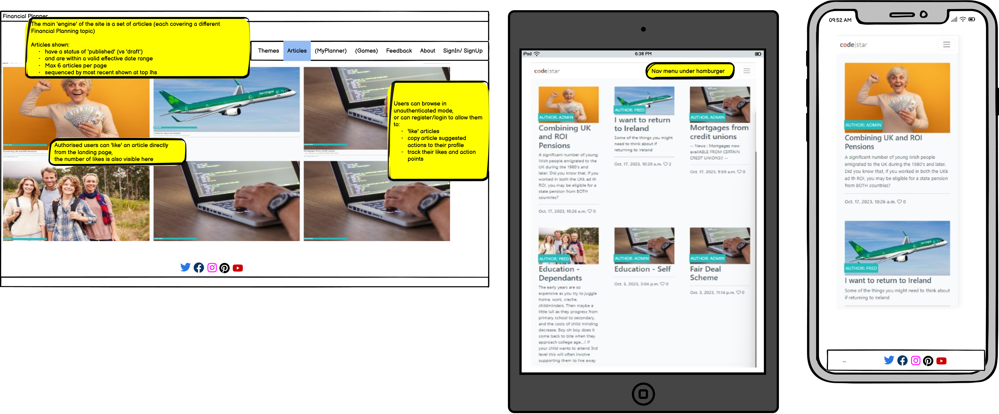

Lifestage Planner - themed access to Articles

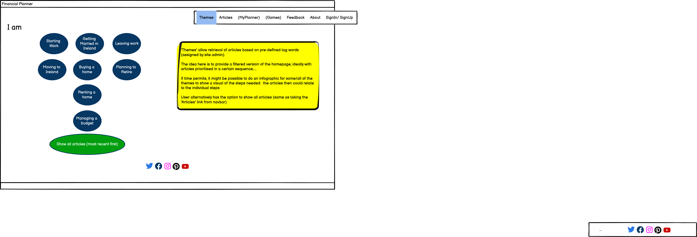

Article detail - with suggested actions

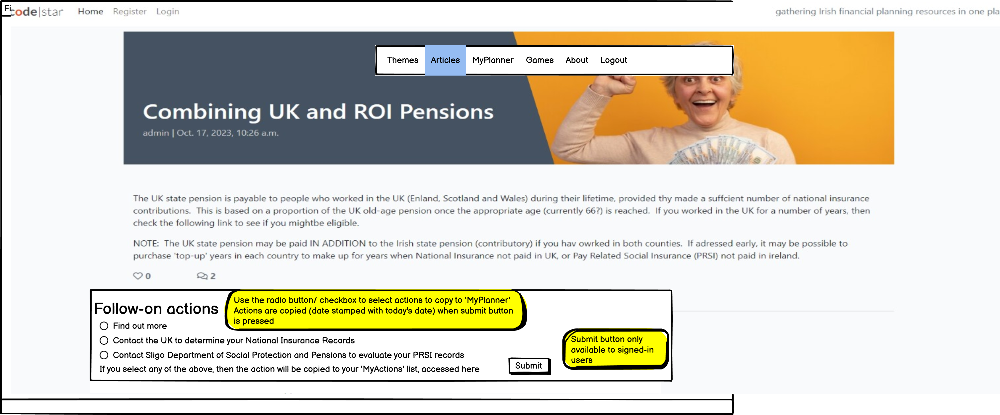

My Planner - personalised user profile/action tracker

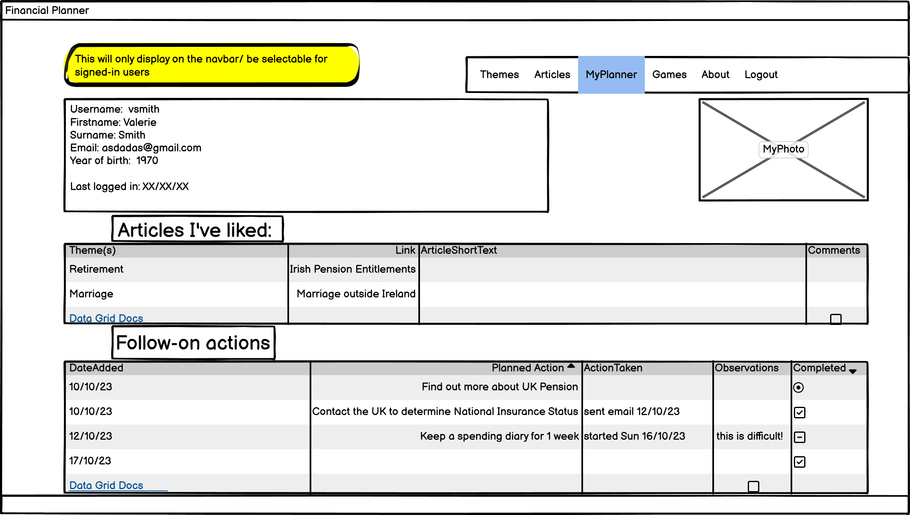

About/ Feedback page

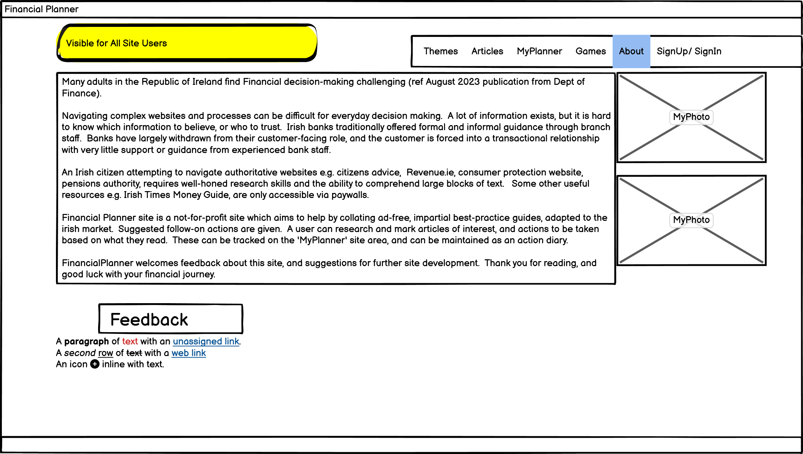

  
### Fonts Chosen
The website itself is designed to be fairly unobtrusive.  Article fonts were somewhat limited with the standard range of Summernote (Article content creator) fonts, the best of the options seemed to be Arial 16.

### Colour Scheme 
Again, designed to be fairly unobtrusive and not to draw attention to the background.  The articles themselves contain a colourful image and content may include images.  A green background colour and a default green-money logo have been used where possible on the site.

### Design Images

### Design Images - Icons and Symbols

Consistent icons and symbols are used throughout the site, and in multiple contexts - e.g. Certain icons for likes, bookmarks, tasks, and responses (comments) appear in both a user and an article context.  These are descibed more fully within the features section.

## Agile
An Agile approach was followed in plannning this project.  This is somewhat in contrast to the developer's well-practised 'waterfall' habits and presented both a challenge and an opportunity to think in a different way about deliverables and incremental delivery.
It was helpful that the developer participated in a hackathon during Sept 2023, and had an opportunity to observe experienced Agile developers, and their use of Github issue tracking in a team environment.
This led to a much clearer understanding of User story and task breakdown, as well as how github can be tailored  to add value, rather than overhead(!), to programming work.
* One precept which was difficult to master was respecting the timeboxing of each iteration.  Attempts to 'just finish' a task by extending the iteration by a day or two, needed to be curbed.  Instead, I had to (will have to) train myself to end the sprint, then assess which work had been completed or not.
* Story points present another challenge.  A very natural interpretation of story points is to assign them a time value (rather than an 'effort' value).  So, at the outset, the most natural approach felt like assigning each task an estimated duration, and reflecting on story points as hours.  This allowed me to capacity plan the first couple of sprints/ iterations based on the time I had available..... I await to see if I will continue this as the project progresses, or whether I move to a more fluid interpretation of SPs.
* However with the magic law of time (better check what magic law this is) creative tasks in which I am fully engaged make the time fly, meaning I can spend quite a bit of elapsed time but without feeling the strain, whereas less desirable tasks cause time to drag!  <- how does this reflect story points?
* Agile representation using github tools

   
### Project
A github project was created within the Financial_Planner repo.  At a high level the project details are very simple really just a name and description.

GitHub Project Setup

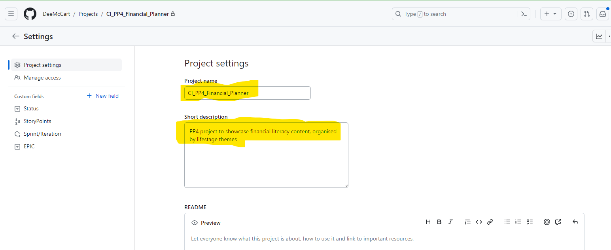

### Issue Template

Issue template - User Story

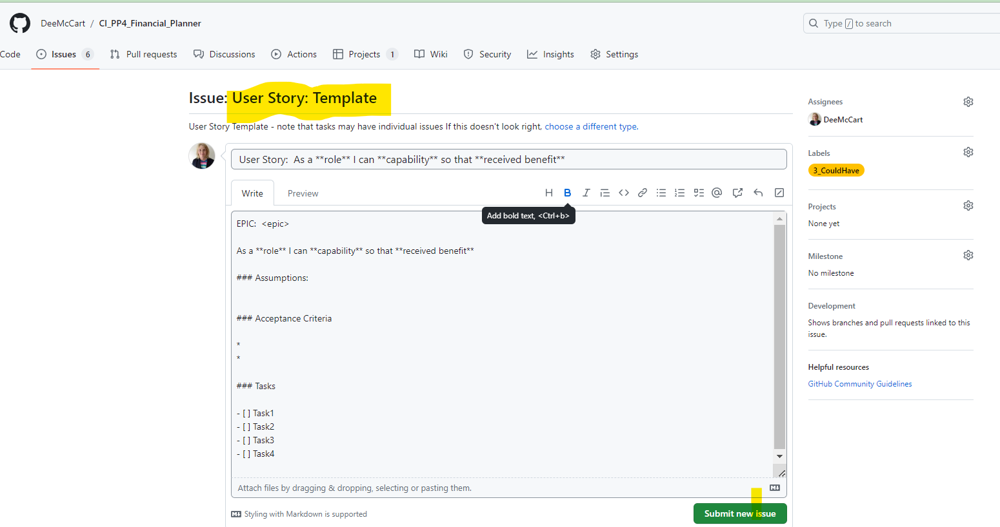

    
At the outset, an issue template was created specifically for user stories.  This holds 5 sections:  
* EPIC:  The parent functional theme for this user story
* A statement of what is to be achieved in the format 'As a **role** I want to **action** to achieve **goal**'.
* Assumptions made when creating this isssue (e.g. pre-requisites)
* Acceptance Criteria: List of conditions to demonstrate the issue has been satisfied/resolved
* Tasks:  Checkbox-marked list of tasks to address this user story.

Mid-way through the project, I created a template to capture project bugs to facilitate separate tracking/reporting.
I found this useful for 'larger' bugs although I maintained an issue logging spreadsheet for the project, and logged almost 70 issues in the 6 or so weeks of development.

### Project Issues
Issues were created to track planned end-to-end work in Financial_Planner, using the issue template for consistent appearance and content.   
Financial_Planner project scope includes UX design tasks, agile project setup, development tasks, documentation,  and testing.

Example issue - user story

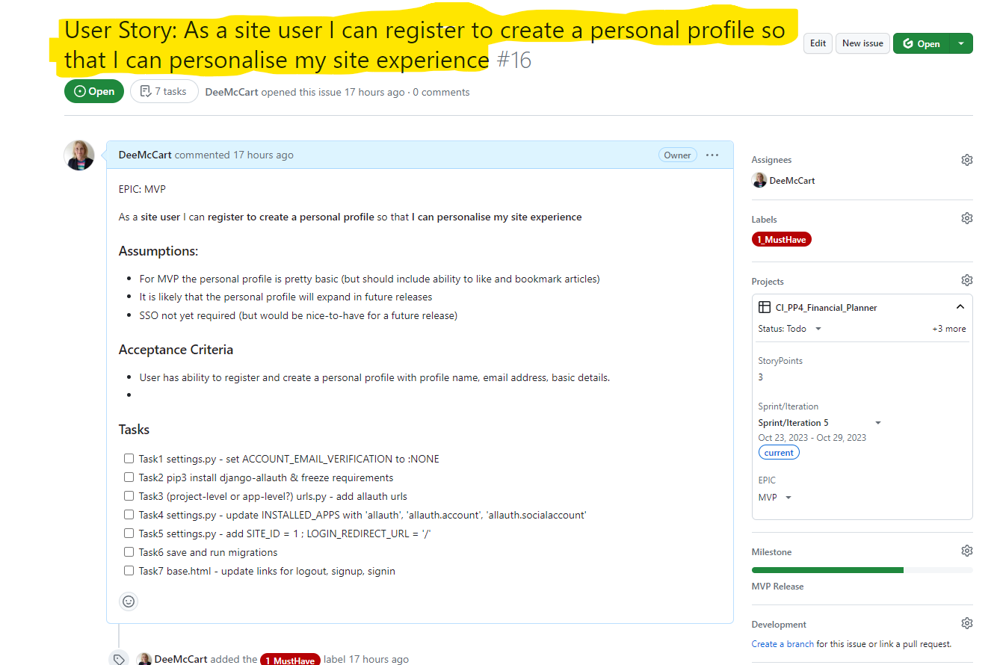

Some of the issues created were in fact tasks, which underpinned several user stories:

Example issue - task

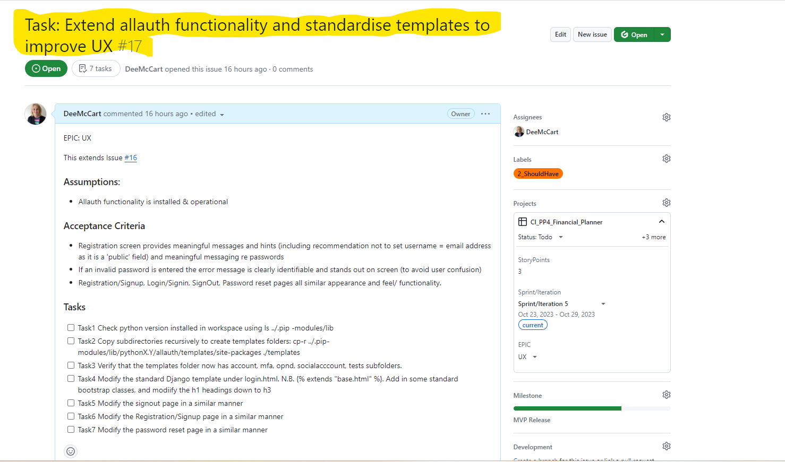

### EPICs
An epic in agile is a large body of work that can be broken down into a number of smaller stories, which are represented as github Issues.
The Financial_Planner project uses custom fields to hold the epic name, some initial high-level epics:  Agile, UX, Docs, MVP.
For clarity EPIC is also listed at the top of each issue.

EPICs

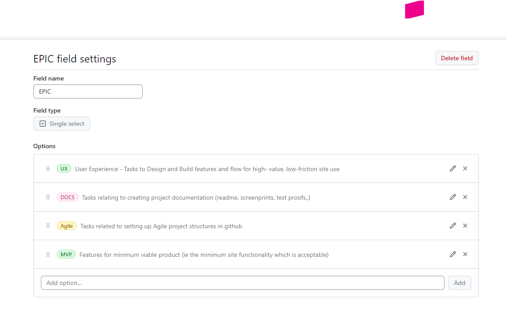

### MoSCoW prioritisation
For prioritising user stories and known tasks, I assigned a label to each issue, one of:
* Must-have
* Should-have
* Could-have (or nice-to-have)
* Won't have (perhaps its a never, or perhaps this just means 'not at this release')
To make selection easier (ensure that these appeared at top of label list in the order above) I preceded each label with a number as shown:

MoSCow labels

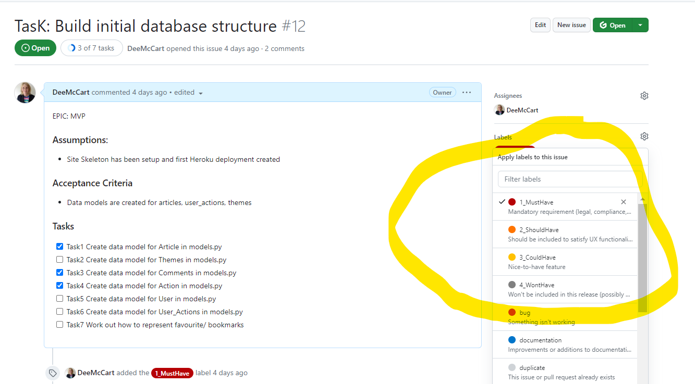

### Story Points
Story points are intended as a 'level of required effort' measure.  I used a custom issue category field to represent these. 
While at the beginning it was easiest to think of story points in terms of 'hours', as the sprints passed it became easier to assess relative to work already completed.
An observation would be that interpreting story points as 'hours' is somewhat one-dimensional, as sometimes the elapsed hours can be greater or lesser depending on mood, state of flow etc.

### Milestones
While this is a relatively short project (developed over 2 months duration), there was sufficient opportunity to set milestones for MVP (mostly consisting of must-have issues) and releases.
The use of MVP milestone encouraged a 'deploy-early' mindset whereby the software could be delivered incrementally, with successive releases building on proven, working software.  
When creating the milestone a due date is needed, initially I set a due date of 3 weeks prior to deadline for MVP, with additional release dates scheduled up to the project deadline.

This approach ensured, it would be possible to deliver a working, functional system, even if difficulties were encountered with implementing some of the 'could-have' features..

Milestones

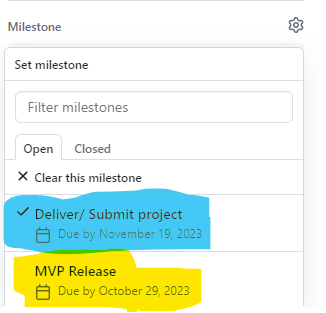

### Sprints and Iterations
In Agile methodology, effort is timeboxed into Srints, with a kickoff at the start of each Sprint time period, in which items from the product backlog are made ready for work (groomed) by ensuring all the details are completed on the user-story/issue card (task details, acceptance criteria, priority, dependencies, Story Point estimate ) before a developer starts working on it.  At the end of a sprint a retrospective should be undertaken to determine what worked well or not during that sprint.
For Financial_Planner a time-period of weekly sprints was chosen.  Loosely (given that the developer consisted of a one-person team), the sprint ran from Monday-Sunday inclusive, and the aim was to complete certain agreed user stories during a particular sprint.

Sprints/ github Iterations

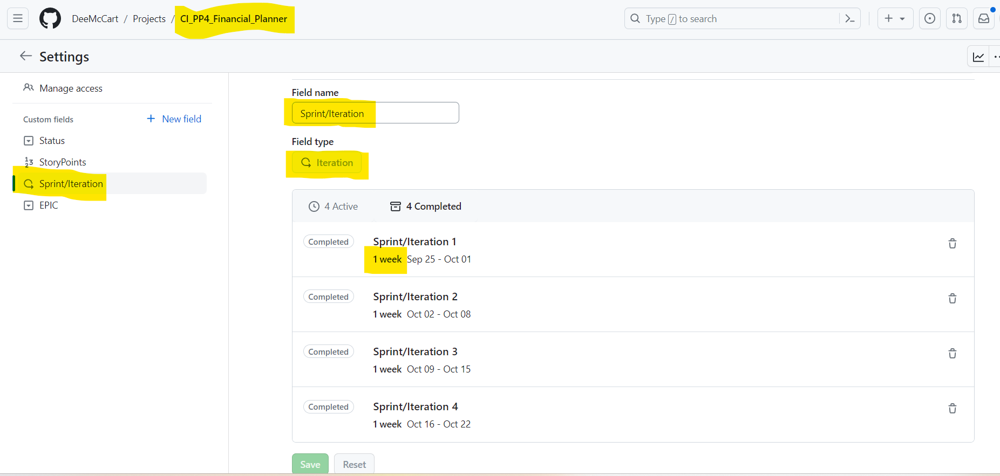

Initially when performing the design tasks (effectively the first four sprints), the timeboxing aspects were not fully respected.
However from sprint5 onwards (the first programming sprint), it became easier to decide clearly what was to be included at the outset of each sprint, and to pull specific issues from the backlog and ensure that they were progressed during the planned sprint. 
I started doing formal sprint reviews with burndown charts, at end of:
[Sprint 5 retrospective]([Issue #24](https://github.com/DeeMcCart/CI_PP4_Financial_Planner/issues/24 target="_blank") )

[Sprint 6 retrospective]([Issue #33](https://github.com/DeeMcCart/CI_PP4_Financial_Planner/issues/33 target="_blank") )

[Sprint 7 retrospective]([Issue #35](https://github.com/DeeMcCart/CI_PP4_Financial_Planner/issues/35 target="_blank") )

[Sprint 8 retrospective]([Issue #47](https://github.com/DeeMcCart/CI_PP4_Financial_Planner/issues/47 target="_blank") )

As each weekly sprint progressed, I became more fluent with the insights/ burndown charts and started to develop to include actual time logged, a useful metric

### Issue Lifeycle
An issue is set to progress through a number of stages, each represented by a status during its lifecycle.  
Issues progressed through:
* Backlog 
* To-do
* In-progress
* Review
* Done

### Tabular Projects View
The tabular view of projects was very useful at the backlog grooming stage, as it shows open issues, and gives easy visiblity of associated fields, e.g. story points, epic, assigned sprint, etc 

Projects - Tabular view

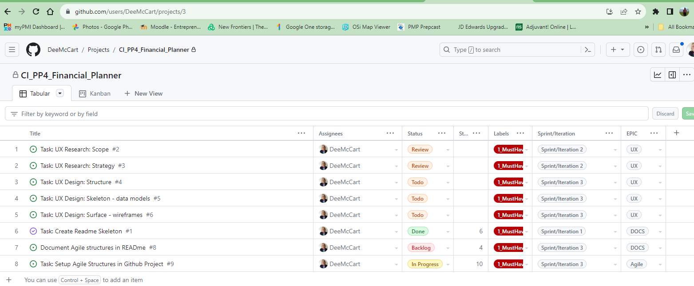

Projects - Tabular view2

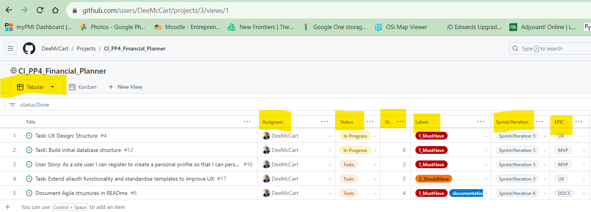

    
### Kanban board
Within a sprint, the kanban board provides invaluable visual tracking.  
In the Financial_Planner kanban board, issues progress from leftmost column (backlog) to rightmost (done)
Note that each column holds a descriptor to tell you what is happening to issues within the column.

Projects - Kanban (simple)

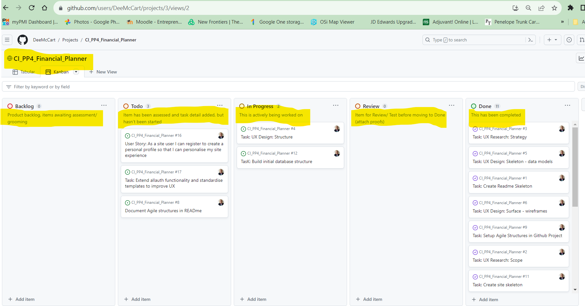

An improved kanban view (developed mid-way through the project) is shown here, note that this shows:
* the number of issues at each kanban board state (e.g. highlighted in blue for InProgress column)
* The storypoints for each individual issue, as well as the total storypoints at each lifecycle status (e.g. highlighted in green for 'Todo' column)
* The EPIC associated with each issue (e.g. highlighted in pink within the 'Done' column)

 
### Agile Observations and learnings
* Observation from hackathon - short user story names are best for visibility and tracking
* Observation from hackathon - a user story is generally a fairly big block with a number of subtasks.  It is not advisable to have an entire user story which is longer than a sprint, as it will be carried forward in the 'to do' or 'in progress' bucket without clear visibility.  Therefore likely to try breaking a complex user story into sub-stories/tasks.  Both the user story and the sub tasks will be listed as issues, the user story will remain in the 'to do' bucket after grooming, and its tasks will be ticked off when their individual issues are completed.  The individual issues will move through the kanban board lifecycle of backlog -> to do -> in progress -> review -> done.  The 'parent' user story will remain at 'to do' (or possibly 'in progress'???)
* Observation from hackathon - when merging of PR (pull requests) was performed in a distributed development environment, it was possible to link the PR to a kanban issue, and to automatically update the issue status based on the PR.   I would be interested in exploring how ths might be done for a solo developr (possibly workflows?)
* Observation - if I reference the issue # on a commit (but must be in the format #8 ) then I can hyperlink from that commit message back to the relevant user story or issue.
* Use of EPIC as a label rather than as an issue - this was an early decision, although when reviewing our cohort leader Alan Bushell's PP4 project, he showed how he had used Issues within Github to represent EPICS.  This seemed to work really well as it was possible to demonstrate a hierarchy of EPIC -> issues by including a link to the sub-issues within the EPIC 'issue' body.  Thus it was possible to click on the issues within the EPIC, check their status, then return to the EPIC.
At the time of seeing this I had already committed to using labels to represent EPICs, so I stayed with my original approach just to see how it would work in practice.
* Use of a public project repo - I made the repo public early on, as I had assumed this was needed for assessment.  And about half way through I was surprised to see some comments on my tasks from another (unknown) github user offering assistance with development - kind of like an open source approach.  So they had commented on a couple of tasks.  I kept the repo public, but changed the settings so that only users who had previously committed to the repo could comment, and I blocked that particular user from the workspace....

## Features 
Implemented features are fully documented in the Features readme, located at  

### Features in Scope 

<a href="https://github.com/DeeMcCart/CI_PP4_Financial_Planner/blob/main/README_Features.md" target="_blank">Site features</a>

It was helpful to create this as a separate document, as it is also offered to users as a 'how to' guide.

### Implementation Decisions
This project was somewhat unusual for me as I followed the Agile principle of not defining every feature fully at the start of a 8-week project process.  Instead, the project evolved and took its own shape over the duration.  I followed a principle of incremental delivery, deployed early and established the core structures pretty much as per the walkthrough training given.
   
Some of the site ideas and features needed only really became clear as I played with the site as it was delivered, and experienced frustration or spotted opportunites or elements that were worth adding. So the site grew organically as time went on.
 
And it would still be growing organically if I didn't have a project dealine to submit (sometimes deadlines are really useful!!!)

### Features Left to Implement

#### F18 Write a custom app for Admin Console (FUTURE)
The FinancialPlanner site as delivered is a good base site with strong core functionality in the areas of content and task management. It has a decent front-end and is depends strongly on a standard Django Admin console in the backend.  However, as the site has incrementally developed, the database model complexity has increase, so there are a number of tables which need to be manually synchrnised, for example articles vs structured search tags, these are maintained separately and require some overhead to ensure they remain well-designed and consistent.
So this site would definitely benefit from a well-designed admin console to simplify the database maintanance overhead

#### F19 Content Creation (ONGOING & FUTURE)
Development of the site has required considerable programming effort however to really make it flourish, well-designed, appropriate content is needed.  There is huge scope for worksheets, budgeting lists, and many other tools to be created and made available to users.  This is where the real site benefit lies, in practical, relevant content that is easily understood and convertible into actionable tasks.

#### F20 Gamification (DEFINITELY FUTURE)
One of the original hopes for this site was to include a 'Game of Life' concept whereby a user could start with a notional financial health rating then take decisions and see the financial impact.  This is effectively a financial modelling exercise, the concept of a 'game' makes it less threatening to users, whereas, it could in fact act as a simulation providing 'what if' financial implications of life decisions.

#### F21 Structured/Lifestage search (NEAR-FUTURE)
The use of the structured article tags to provide a lifestage search feature has been designed and is operational in the backend, but doesnt yet have a front end implementation. This is a key feature as it would allow much more granular content filtering and greatly assist users by filtering down to just articles aligned with the user's needs e.g. 'I want to.... get a mortgage', 'I want to.... move to Ireland', 'I want to.... plan for later life' 

#### F22 UX and Integration features
Would like a 'share' button on articles and the ability to connect to whatsapp and other social media portals.
Would like to be able to send email notification for password reminders.
Would like to improve appearance of task and response windows, they are functional now but could be more beautiful.

#### Other features to be identified via target-user interaction
There are lots of other features which could be useful.  The version of FinancialPlanner delivered today is really a proof-of-concept and ideally it would now be exposed to a wider group of potential users, and based on their feedback and real-life needs, a development road map coud be established.  In the absence of an app to show, it has been difficult to have the 'what would you like in a financial literacy app?' discussion with potential users, but the FinancialPlanner app as-is is fine for demo and discussion purposes.
I would hope to develop FinancialPlanner further as a commercial app.  
               
## Technologies

### Langugages
- HTML 
- CSS
- Javascript
- Python
- Django (initial v 3, now V4+)
- Bootrap (V5)

### Frameworks & Tools
* Github:  used to maintain the code repository, and for some readme edits and commits
* Git
* Gitpod:  used for editing and for tracking code commits back to Github
* Balsamiq:  used for wireframing
* Lucidchart: used for database diagramming
* Canva: used to create some infographic content
* Leonardo AI: used to create some of the site images

### Python Libraries
The following additional python libraries were used:

### Third-Party Libraries

## Validation 

### HTML Validation 
- HTML
HTML validation was performed for the various site pages as follows:  Render the page via the app, right click on the page contents and take option to copy (rendered) source.  Paste this into a file and subject that file to the W3C validator.  

  - All errors returned from the validator were pursued and resolved.  Examples are shown below:
 
  on the index html pages when checked in the W3C validator:

  - ")

  - ")

  - ") 

   - ") 
  
  
  - [W3C validator - 404 page](https://validator.w3.org/nu/?doc=https%3A%2F%2Fdeemccart.github.io%2FCI_PP4_Financial_Planner%2F404.html)
  
  - [W3C validator - settings page](https://validator.w3.org/nu/?doc=https%3A%2F%2Fdeemccart.github.io%2FCI_PP4_Financial_Planner%2Fsettings.html)

### CSS Validation
  - No errors returned when passing through the official [(Jigsaw) validator](https://jigsaw.w3.org/css-validator/validator?uri=https://deemccart.github.io/CI_PP4_Financial_Planner/&profile=css3svg&usermedium=all&warning=1&vextwarning=&lang=en) 

### Javascript Validation
  - No errors returned, when javascript was pasted into the jshint validator - 

jshint - no errors 

### Accessibility
The site was tested using the WAVE WebAIM accessibility evaluation tool.
All pages pass with 0 errors 
- [Accessibility: index page](https://wave.webaim.org/report#/https://deemccart.github.io/CI_PP4_Financial_Planner/)
- [Accessibility: 404 page](https://wave.webaim.org/report#/https://deemccart.github.io/CI_PP4_Financial_Planner/404.html)

### Performance
Performance for all pages was tested using the Lighthouse tool within Google Chrome.  Performance was at 98% for the index page (intro modal).

Performance: Index page

### Device Testing
The website was tested on the following devices:
* HP laptop & associated widescreen monitor
* Samsung Galaxy S10 tablet
* Motorola G(7) android phone

### Multi-browser Testing
The website was tested on the following browsers:
* Google Chrome v112.0.5615.138 (HP laptop)
* Google Chrome v112.0.5615.136 (Samsung Galaxy tablet)
* Mozilla Firefox v112.1.0 (Motorola g(7) phone)

### Testing Features

### Bugs and issues
Almost 70 issues were recorded, I used an excel spreadhseet to keep track.  At the time of writing, 9 issues remain open.
The structure of the log is shown here:

issue tracker

And the remaining open issues are listed here:

issue tracker

## Deployment
 
* The site was deployed to GitHub pages. The steps to deploy are as follows: 
  - In the GitHub repository, navigate to the Settings tab - pages 
  - From the source section drop-down menu, select the Master Branch
  - Once the master branch has been selected, the page will be automatically refreshed with a detailed ribbon display to indicate the successful deployment. 

The live link can be found here - https://deemccart.github.io/CI_PP4_Financial_Planner/index.html

* To fork the repository:
- Go to the GitHub repository
- Click on Fork button in the upper right hand corner

* To clone the repository:
- Go to the GitHub repository
- Locate the Coe button above the list of files and click it
- Select if you prefer to clone using HTTPS, SSH, or Github CLI and click the copy button to copy the URL to you clipboard
- Open Git Bash
- Change the current working directory to the one where you want the cloned directory
- Type git clone and paste the URL from the clipboard($ git clone https://github.com/YOUR-USERNAME/YOUR-REPOSITORY)
- Press Enter to create your local clone

## Credits 
Multiple sources were used in assembling this site.

### Content - Financial Planner
* Inspiration taken from many many sources
* Existing sites and offerings towards financial literacy in Ireland:  (list below)
* 
### Financial Planner site ethos - authenticity
https://nobsmarketplace.com/blog/how-do-you-know-if-website-authoritative/ offers a definition of an authoritative website as 'a trusted source that offers reliable information to users'
https://nobsmarketplace.com/blog/how-do-you-know-if-website-authoritative/ factors to determine an authoritative website: site domain name/url; value offered to the user; reputable sources (with verifiable credentials); quality of inbound & outbound links; website UX, design & functionality; proven user trust & engagement (e.g. measured by organic comments, likes and shares given by customers/users, as well as the quality of the audience the website has attracted)

### Agile implementation in github
* https://docs.github.com/en/issues/planning-and-tracking-with-projects/understanding-fields/about-text-and-number-fields#adding-a-number-field to understand how story points might be represented in GitHub
 
### Code - Financial Planner
Dennis Ivy
Multiple Code Institute PP4 projects used for reference

### References
The following sites were ued for research and better understanding while creating this website: 

 
### Acknowledgements
* I would particularly like to thank Alan Bushell, our cohort facilitator who guided us through this partiularly diverse phase of the course, kept us on track with weekly standups, ensured we all stepped into the limelight and provided really useful advice.
* I would like to sincerely thank my mentor, Mo Shami for his kindness, enthusiasm and support throughout.  Mo's ability to absorb the essence of a situation and to communicate a clear path ahead has been invaluable.
* I would also like to thank Derek and my family for their personal support, and for their help with system testing.

